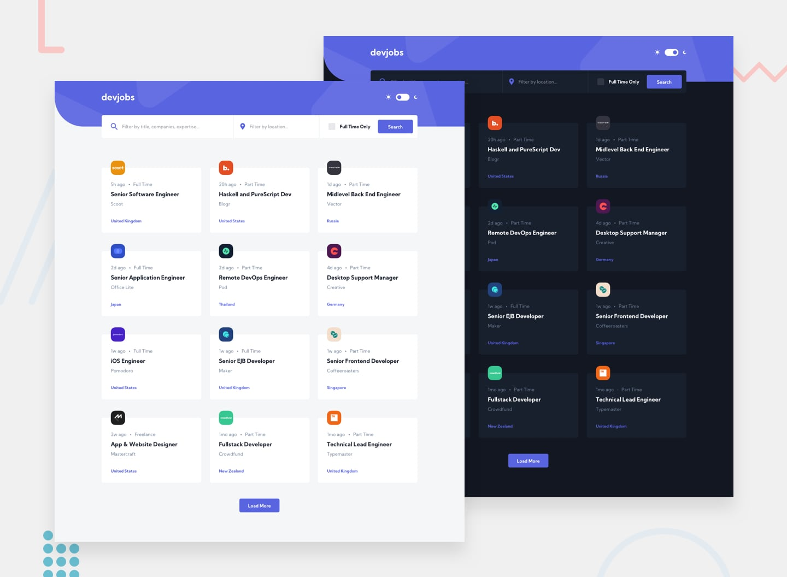

# Frontend Mentor - Devjobs web app solution <!-- omit in toc -->

This is a solution to the [Devjobs web app challenge on Frontend Mentor](https://www.frontendmentor.io/challenges/devjobs-web-app-HuvC_LP4l). Frontend Mentor challenges help you improve your coding skills by building realistic projects.

## Table of contents <!-- omit in toc -->

- [Overview](#overview)
  - [The challenge](#the-challenge)
  - [Screenshot](#screenshot)
  - [Links](#links)
- [My process](#my-process)
  - [Built with](#built-with)
  - [Useful resources](#useful-resources)
- [Author](#author)

## Overview

### The challenge

To build out a jobs board using the provided data, trying to get your project looking as close to the reference design as possible.

Users should be able to:

- View the optimal layout for each page depending on their device's screen size
- See hover states for all interactive elements throughout the site
- Be able to filter jobs on the index page by title, location, and whether a job is for a full-time position
- Be able to click a job from the index page so that they can read more information and apply for the job
- **Bonus**: Have the correct color scheme chosen for them based on their computer preferences. _Hint_: Research `prefers-color-scheme` in CSS.

### Screenshot

### Links

- [Solution](https://www.frontendmentor.io/solutions/devjobs-web-app-nextjs-mongodb-react-query-react-hook-form-rjRfBBiC6)
- [Repository](https://github.com/richardcyrus/fm-devjobs-web-app)
- [Live Site](https://fm-devjobs-web-app.vercel.app/)

## My process

### Built with

- Semantic HTML5 markup
- Flexbox
- CSS Grid
- Mobile-first workflow
- [TailwindCSS](https://tailwindcss.com/)
- [React](https://reactjs.org/) - JS library
- [Tanstack Start](https://tanstack.com/start/latest) - React based framework
- [Tanstack Query](https://tanstack.com/query/latest)
- [Tanstack Form](https://tanstack.com/form/latest)

### Useful resources

- [A Modern CSS Reset](https://piccalil.li/blog/a-modern-css-reset/)
- [A Complete Guide to Flexbox](https://css-tricks.com/snippets/css/a-guide-to-flexbox/)
- [A Complete Guide to Grid](https://css-tricks.com/snippets/css/complete-guide-grid/)
- [Pure CSS Custom Checkbox Style](https://moderncss.dev/pure-css-custom-checkbox-style/)
- [useWindowSize Hook](https://usehooks.com/useWindowSize/)
- [How to use Variable in a Regular Expression in JavaScript](https://reactgo.com/javascript-variable-regex/)
- [Filtering Data With React-Query Library](https://apiumhub.com/tech-blog-barcelona/filtering-data-with-react-query-library/)

## Author

- Website - [www.richardcyrus.com](https://www.richardcyrus.com)
- Frontend Mentor - [@richardcyrus](https://www.frontendmentor.io/profile/richardcyrus)
